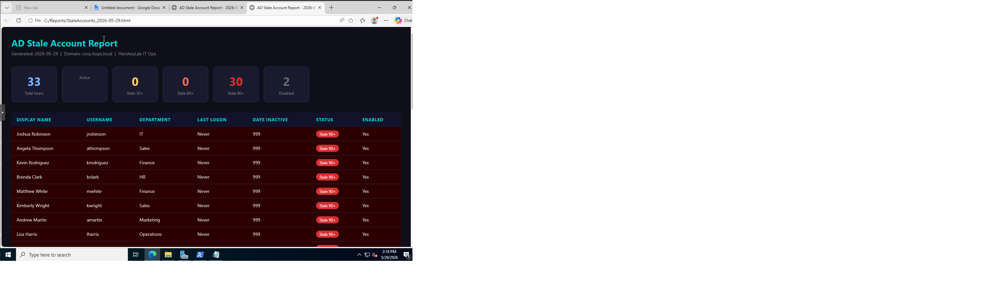
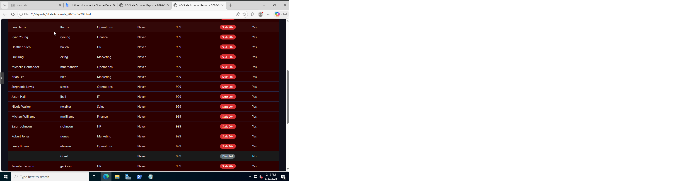
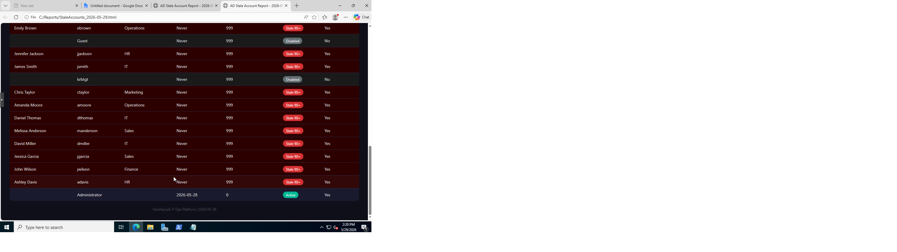

<div align="center">

# 🏢 HersheyLab — Enterprise IT Ops Platform
### Active Directory Visibility · Endpoint Monitoring · Maintenance Automation


> A homelab-built enterprise IT operations platform designed to solve **real sysadmin problems** —
> stale account reporting, safe patch window detection, and endpoint visibility.
> Built from scratch on Proxmox with Windows Server 2022 and PowerShell.

</div>

---

## 📋 Table of Contents

- [Why This Exists](#-why-this-exists)
- [What It Does](#-what-it-does)
- [Architecture](#-architecture)
- [Prerequisites](#-prerequisites)
- [Part 1 — Proxmox Setup](#-part-1--proxmox-setup)
- [Part 2 — Create the Windows Server VM](#-part-2--create-the-windows-server-vm)
- [Part 3 — Install Windows Server 2022](#-part-3--install-windows-server-2022)
- [Part 4 — Post-Install Configuration](#-part-4--post-install-configuration)
- [Part 5 — Promote to Domain Controller](#-part-5--promote-to-domain-controller)
- [Part 6 — Populate Active Directory](#-part-6--populate-active-directory)
- [Screenshots](#screenshots)
- [Real Errors & Workarounds](#-real-errors--workarounds)
- [Roadmap](#-roadmap)

---

## 💡 Why This Exists

Every sysadmin team deals with the same headaches:

| Problem | The Pain |
|---|---|
| **Stale AD Accounts** | Management asks for a list of inactive users — you spend an hour pulling it manually |
| **Patch Window Guessing** | You try to remote into a machine to push a patch but the user might still be logged in — you don't know |
| **No Visibility** | There's no single place to see who's active, when they work, and whether it's safe to touch their machine |

This platform was built to fix all three. The goal is a tool that a solo IT admin or small MSP team can run, get clean answers immediately, and stop wasting time on manual reporting.

---

## 🔧 What It Does

```
┌─────────────────────────────────────────────────────────┐
│                   HERSHEYLAB IT OPS                     │
├─────────────────┬───────────────────┬───────────────────┤
│  AD REPORTING   │  ACTIVITY PROFILER│  PATCH WINDOWS    │
│                 │                   │                   │
│ • Stale users   │ • Login heatmaps  │ • Risk scores     │
│ • 30/60/90 day  │ • Logoff patterns │ • Safe windows    │
│ • CSV/HTML out  │ • Per-user hours  │ • Fleet overview  │
└─────────────────┴───────────────────┴───────────────────┘
```

### Problem 1 — Stale Account Reporting
Pull every AD user with their last login timestamp and flag them by inactivity threshold (30, 60, or 90 days). Output a clean, shareable HTML or CSV report instead of doing it manually every time someone asks.

### Problem 2 — User Activity Profiling
Collect Windows Security Event Log data (Event ID 4624 logon / 4634 logoff) to build a per-user activity profile. Answer the question: *"Is this person likely still at their computer right now?"* before you remote in or push a patch.

### Problem 3 — Safe Maintenance Windows
Analyze activity profiles across the fleet and calculate the lowest-risk windows for patching or maintenance — ranked by how many users are typically inactive during that time.

---

## 🏗 Architecture

```
Proxmox Host (hersheylab)
├── Ubuntu VM 1          — existing infrastructure
├── Ubuntu VM 2          — existing infrastructure  
└── WIN-DC01             — dedicated Domain Controller
    ├── Windows Server 2022 Evaluation
    ├── Active Directory Domain Services
    ├── DNS Server
    ├── Static IP: 192.168.X.X  (masked)
    └── Domain: corp.itops.local
         ├── OU: IT
         ├── OU: HR
         ├── OU: Finance
         ├── OU: Operations
         ├── OU: Marketing
         ├── OU: Sales
         └── 30 domain users across all OUs
```

**Three-Layer Design:**
```
[ Data Collection ]          [ Processing ]          [ Presentation ]
  PowerShell scripts    →    SQLite / CSV / JSON  →  HTML Dashboard
  AD queries                 Scheduled jobs           Export reports
  Event log polling          Aggregation engine        Web UI (planned)
```

---

## 📦 Prerequisites

Before you start you will need:

- ✅ A machine running **Proxmox VE** (any recent version)
- ✅ At least **4GB RAM free** for the Windows Server VM (8GB recommended)
- ✅ At least **80GB free disk space** on your Proxmox storage
- ✅ Internet access from your Proxmox host to download ISOs
- ✅ A web browser to access the Proxmox UI

> 💡 **No Windows license needed.** We use the free 180-day Microsoft Evaluation ISO which is fully functional.

---

## 🖥 Part 1 — Proxmox Setup

### Step 1.1 — Download Both ISOs

Open your **Proxmox Node Shell** (click your node in the sidebar → Shell) and run these commands one at a time.

> ⚠️ **Important:** Paste each command as a **single line**. See [Paste Issues workaround](#issue-1--bracketed-paste-mode-error) if you get errors.

**Download VirtIO Drivers (~750MB):**
```bash
wget -O /var/lib/vz/template/iso/virtio-win.iso "https://fedorapeople.org/groups/virt/virtio-win/direct-downloads/stable-virtio/virtio-win.iso"
```

**Download Windows Server 2022 (~5GB):**
```bash
wget -O /var/lib/vz/template/iso/WinServer2022.iso "https://go.microsoft.com/fwlink/p/?LinkID=2195280&clcid=0x409&culture=en-us&country=US"
```

> ⏱️ The Windows ISO takes 2-3 minutes on a fast connection. You'll see a progress bar with percentage and speed.

### Step 1.2 — Verify Both Downloaded

```bash
ls -lh /var/lib/vz/template/iso/
```

**Expected output:**
```
total 8.2G
-rw-r--r-- 1 root root 754M Sep 11  2025 virtio-win.iso
-rw-r--r-- 1 root root 4.7G Mar 16  2022 WinServer2022.iso
```

> ❌ If either file shows a tiny size (like 10KB) the download link redirected. Re-run the wget command.

---

## 🖥 Part 2 — Create the Windows Server VM

In the Proxmox web UI click **Create VM** (top right button).

### General Tab
| Setting | Value |
|---|---|
| Node | Your Proxmox hostname |
| Name | `WIN-DC01` |

### OS Tab
| Setting | Value |
|---|---|
| ISO Image | `WinServer2022.iso` |
| Guest OS Type | `Microsoft Windows` |
| Version | `11/2022/2025` |

### System Tab
| Setting | Value |
|---|---|
| Machine | `q35` |
| BIOS | `OVMF (UEFI)` |
| Add EFI Disk | ✅ Checked |
| SCSI Controller | `VirtIO SCSI Single` |
| Qemu Agent | ✅ Checked |
| TPM State | Add → `v2.0` |

### Disks Tab
| Setting | Value |
|---|---|
| Bus/Device | `VirtIO Block` |
| Storage | `local-lvm` |
| Disk Size | `80GB` |
| Cache | `Write back` |

> 💡 **Not sure which storage to use?** Run `pvesm status` in the Proxmox shell. Use the `lvmthin` type storage for VM disks — it's faster and more efficient.

### CPU Tab
| Setting | Value |
|---|---|
| Sockets | `1` |
| Cores | `2` |
| Type | `host` |

### Memory Tab
| Setting | Value |
|---|---|
| Memory | `4096 MB` |

### Network Tab
| Setting | Value |
|---|---|
| Bridge | `vmbr0` |
| Model | `VirtIO (paravirtualized)` |

Click **Finish** — but **do not start the VM yet.**

### Add VirtIO as Second CD Drive

1. Click your `WIN-DC01` VM → **Hardware** tab
2. Click **Add** → **CD/DVD Drive**
3. Set: Bus `IDE`, Device `1`, ISO: `virtio-win.iso`
4. Click **Add**

You should now see two CD drives in the hardware list:
```
CD/DVD Drive (ide1)   local:iso/virtio-win.iso
CD/DVD Drive (ide2)   local:iso/WinServer2022.iso
```

---

## 💿 Part 3 — Install Windows Server 2022

1. Click **Start** on the VM
2. Immediately click **Console** to open the display
3. Click inside the console and **press any key** when prompted to boot from CD

> ⏱️ You have about 3 seconds to press a key. If you miss it just restart and try again.

### Installation Steps

**Screen 1 — Language:** Leave defaults → **Next** → **Install Now**

**Screen 2 — Product Key:** Click **"I don't have a product key"** at the bottom

**Screen 3 — Select Version:** ⚠️ Choose exactly:
```
Windows Server 2022 Standard Evaluation (Desktop Experience)
```
> Make sure it says **Desktop Experience** — the options without it are command line only.

**Screen 4 — License:** Check accept → **Next**

**Screen 5 — Install Type:** Select **Custom (advanced)**

**Screen 6 — Disk Selection:** ⚠️ The disk list will be completely empty — this is normal.

```
1. Click "Load Driver"
2. Click "Browse"
3. Navigate to VirtIO CD → viostor → 2k22 → amd64
4. Click OK
5. Select the driver that appears
6. Click Next
```

Your 80GB disk will appear. Select it → **Next**. Installation takes about 10-15 minutes.

---

## ⚙️ Part 4 — Post-Install Configuration

### Step 4.1 — Set Administrator Password

When Windows first boots it will ask you to set a password.

> 🔒 **Write this down and store it safely.** Losing the DC Administrator password is a significant recovery process.

Suggested format: `SomeThing@Unique2024!`

### Step 4.2 — Log In

In the Proxmox console you cannot press Ctrl+Alt+Delete normally — it gets captured by your local machine instead.

> 💡 Look at the **left edge of the VNC console window** — there's a small vertical toolbar. Click the keyboard icon there to send Ctrl+Alt+Delete to the VM.

### Step 4.3 — Install VirtIO Guest Tools

1. Open **File Explorer** inside the VM
2. Navigate to the VirtIO CD drive
3. Run `virtio-win-guest-tools.exe` as Administrator
4. Install with all defaults — installs network, display, and guest agent drivers
5. Reboot when prompted

### Step 4.4 — Set a Static IP

> ⚠️ A Domain Controller must always have a static IP. Never leave it on DHCP.

Go to **Settings → Network → Change adapter options → right-click adapter → Properties → IPv4 → Properties**

| Field | Value |
|---|---|
| IP Address | `192.168.X.10` *(use your subnet)* |
| Subnet Mask | `255.255.255.0` |
| Default Gateway | `192.168.X.1` *(your router IP)* |
| Preferred DNS | `127.0.0.1` |
| Alternate DNS | `8.8.8.8` |

> 💡 **Finding your subnet:** Log into your router admin page → Advanced → Network → LAN. Your LAN IP is your gateway.

> ⚠️ **Pick an IP outside your DHCP pool** or reserve it in your router so nothing else gets assigned that address.

### Step 4.5 — Rename the Computer

Right-click **Start** → **System** → **Rename this PC** → `WIN-DC01` → Restart

---

## 🏰 Part 5 — Promote to Domain Controller

### Step 5.1 — Install AD DS Role

1. Open **Server Manager**
2. Click **Add Roles and Features**
3. Role-based installation → select your server → **Next**
4. Check **Active Directory Domain Services**
5. When prompted click **Add Features**
6. Click through → **Install**
7. Wait for completion (2-3 minutes)

### Step 5.2 — Promote to DC

When install finishes a **yellow flag** appears at the top of Server Manager.

1. Click the flag → **"Promote this server to a domain controller"**
2. Select **Add a new forest**
3. Root domain name: `corp.itops.local`

**Domain Controller Options:**

| Setting | Value |
|---|---|
| Forest functional level | `Windows Server 2016` |
| Domain functional level | `Windows Server 2016` |
| DNS Server | ✅ Checked |
| Global Catalog | ✅ Checked |
| DSRM Password | Set and write it down |

4. DNS Options screen — ignore the delegation warning → **Next**
5. NetBIOS name auto-fills as `CORP` — leave it
6. Leave all paths as default
7. **Install**

Server reboots automatically. Log back in as `CORP\Administrator`.

### Step 5.3 — Verify AD is Healthy

Open **PowerShell as Administrator** and run:

```powershell
Get-ADDomain
```

You should see output like:
```
DNSRoot           : corp.itops.local
DomainMode        : Windows2016Domain
Name              : corp
NetBIOSName       : CORP
PDCEmulator       : WIN-DC01.corp.itops.local
```

If you see that output — your Domain Controller is fully operational. ✅

---

## 👥 Part 6 — Populate Active Directory

Run this script in PowerShell to create a realistic enterprise AD environment with departments, groups, and 30 users.

> 💡 **Copy/paste tip:** See [Copy-Paste Workaround](#issue-3--copy-paste-into-proxmox-vnc-console) if you can't paste into the VM console.

```powershell
$domain = "DC=corp,DC=itops,DC=local"
$depts = @("IT","HR","Finance","Operations","Marketing","Sales")

# Create department OUs
foreach ($dept in $depts) {
    New-ADOrganizationalUnit -Name $dept -Path $domain -ErrorAction SilentlyContinue
}

# Create security groups
foreach ($dept in $depts) {
    New-ADGroup -Name "GRP-$dept" `
        -GroupScope Global `
        -GroupCategory Security `
        -Path "OU=$dept,$domain"
}

# Create 30 users
$firstNames = @("James","Sarah","Michael","Emily","Robert","Jessica","David","Ashley","John","Amanda",
                "Chris","Melissa","Daniel","Jennifer","Matthew","Lisa","Andrew","Angela","Joshua","Brenda",
                "Kevin","Stephanie","Brian","Nicole","Jason","Heather","Ryan","Michelle","Eric","Kimberly")

$lastNames = @("Smith","Johnson","Williams","Brown","Jones","Garcia","Miller","Davis","Wilson","Moore",
               "Taylor","Anderson","Thomas","Jackson","White","Harris","Martin","Thompson","Robinson","Clark",
               "Rodriguez","Lewis","Lee","Walker","Hall","Allen","Young","Hernandez","King","Wright")

for ($i = 0; $i -lt 30; $i++) {
    $first = $firstNames[$i]
    $last  = $lastNames[$i]
    $dept  = $depts[$i % $depts.Count]
    $sam   = "$($first.ToLower()[0])$($last.ToLower())"
    $upn   = "$sam@corp.itops.local"
    $ou    = "OU=$dept,$domain"

    New-ADUser -Name "$first $last" `
        -GivenName $first `
        -Surname $last `
        -SamAccountName $sam `
        -UserPrincipalName $upn `
        -Path $ou `
        -AccountPassword (ConvertTo-SecureString "Homelab@2024!" -AsPlainText -Force) `
        -Enabled $true `
        -Department $dept `
        -Title "$dept Analyst"

    Add-ADGroupMember -Identity "GRP-$dept" -Members $sam
}

Write-Host "Done: $($depts.Count) OUs, $($depts.Count) groups, 30 users created" -ForegroundColor Green
```

### Verify Everything Was Created

```powershell
# Check all users
Get-ADUser -Filter * | Select-Object Name, SamAccountName, Enabled | Format-Table -AutoSize

# Check all OUs
Get-ADOrganizationalUnit -Filter * | Select-Object Name, DistinguishedName | Format-Table -AutoSize
```

**Expected result:** 30 users + Administrator + Guest + krbtgt across 6 department OUs ✅


## Screenshots

### Stale Account Report Dashboard



---

## 🐛 Real Errors & Workarounds

These are actual errors encountered during this build — documented so you don't have to figure them out from scratch.

---

### Issue 1 — Bracketed Paste Mode Error

**What happened:**
```
root@hersheylab:~# ^[[200~wget -O /var/lib/vz/template/iso/virtio-win.iso \
-bash: $'\E[200~wget': command not found
```

**Why it happens:**
The Proxmox shell has bracketed paste mode enabled. When you paste a multi-line command it wraps it in escape characters (`^[[200~`) that bash doesn't understand.

**Fix:**
Paste the command as a **single line** with no line breaks. Instead of:
```bash
wget -O /path/to/file.iso \
"https://url.com"
```
Use:
```bash
wget -O /path/to/file.iso "https://url.com"
```

---

### Issue 2 — ISO Image Shows Red / Not Found in VM Creator

**What happened:**
On the OS tab of the VM creation wizard the ISO image field showed red and no ISOs were selectable.

**Why it happens:**
The ISOs hadn't been downloaded yet, or Proxmox was looking at the wrong storage pool.

**Fix:**
1. Download the ISOs first using the wget commands in the node shell
2. Make sure the storage dropdown is set to `local` (not `local-lvm`)
3. ISOs must be in `/var/lib/vz/template/iso/` to appear in the list

---

### Issue 3 — Copy-Paste Into Proxmox VNC Console

**What happened:**
Trying to paste PowerShell scripts into the Windows Server VM console didn't work. The Proxmox VNC clipboard button was present but ineffective for large scripts.

**The Workaround That Actually Works:**

> 💡 Open **Google Docs** (or any shared document) on **both your local machine and inside the VM's browser**. Paste your script into the doc from your local machine, then copy it from the doc inside the VM and paste directly into PowerShell. No special tools needed.

**Step by step:**
1. On your local machine open `docs.google.com` and create a new doc
2. Paste your script into the doc
3. Inside the VM open **Edge browser** → go to the same Google Doc
4. Copy the script from inside the VM's browser
5. Paste into PowerShell — works perfectly

> This same trick works for any large text you need to move between your local machine and a VM console.

---

### Issue 4 — Empty Disk List During Windows Installation

**What happened:**
During Windows setup on the "Where do you want to install?" screen — no disks appeared at all.

**Why it happens:**
Windows doesn't include VirtIO storage drivers by default. The virtual disk uses a paravirtualized controller that Windows can't see without the driver.

**Fix:**
1. Click **Load Driver** on the empty disk screen
2. Browse to the VirtIO CD drive → `viostor` → `2k22` → `amd64`
3. Select the driver → Next
4. The 80GB disk will appear immediately

---

### Issue 5 — Ctrl+Alt+Delete Doesn't Work in Console

**What happened:**
Pressing Ctrl+Alt+Delete to log into Windows from the Proxmox console had no effect — the local machine captured the shortcut instead.

**Fix:**
Look at the **left edge of the VNC console window** in Proxmox. There is a small vertical toolbar with icons. One of them sends Ctrl+Alt+Delete directly to the VM. Click that instead of using the keyboard shortcut.

---

## 🗺 Roadmap

- [x] Proxmox VM setup
- [x] Windows Server 2022 installation
- [x] Active Directory domain (corp.itops.local)
- [x] 30 simulated enterprise users across 6 departments
- [X] Stale account report script (30/60/90 day thresholds)
- [X] HTML/CSV export for stale account reports
- [ ] Event log collector (Event ID 4624/4634)
- [ ] Per-user login activity profiler
- [ ] Safe maintenance window calculator
- [ ] Centralized dashboard UI
- [ ] MSP multi-tenant support

---

## 🔐 Security Notes

- All IP addresses in this documentation are masked (`192.168.X.X`)
- Domain credentials used in scripts are for lab/eval environments only
- Never use lab passwords in production
- The Windows Server 2022 Evaluation license expires after 180 days

---

## 📄 License

This project is open source and available under the [MIT License](LICENSE).

---

<div align="center">

Built with 💻 in a homelab · Solving real sysadmin problems one script at a time

</div>
